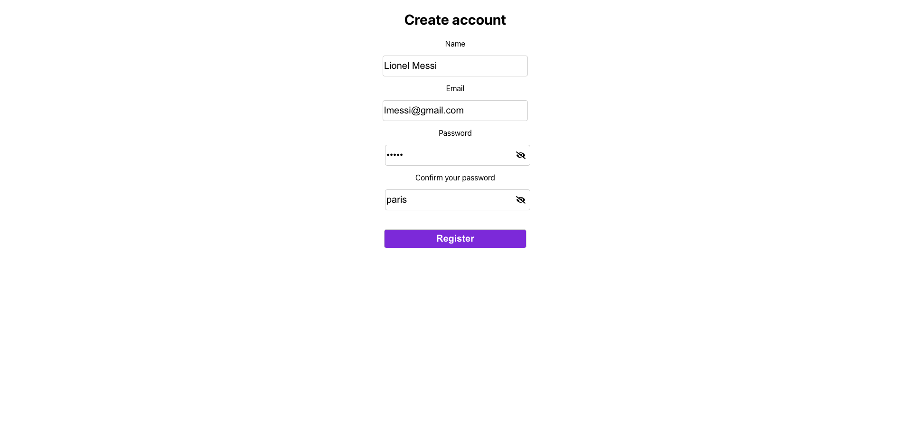

# simple-form :memo:

:date: January 2023
:paintbrush: Frontend
:link: Netlify check it [here](https://zippy-profiterole-59da25.netlify.app/)

## Overview - Welcome :dog:

---

This project was made at [Le Reacteur](https://www.lereacteur.io/) Bootcamp.
4 screens are avalaible: desktop, form and informations filled
mobile phone,form and informations filled

## Tasks :pencil2:

---

:ballot_box_with_check: Create layout  
:ballot_box_with_check: Display user's informations
:ballot_box_with_check: Use states
:ballot_box_with_check: Remove tasks  
:ballot_box_with_check: Fix unvalid values (error messages)

## Stacks :books:

---

[Javascript](https://www.w3schools.com/js/default.asp)  
[ReactJS](https://fr.reactjs.org/docs/getting-started.html)  
[HTML5](https://www.w3schools.com/html/default.asp)  
[CSS3](https://www.w3schools.com/css/default.asp)

## Installation :hammer_and_wrench:

---

Be sure, you have installed all dependencies to run the project.

### Run the project :man_dancing:

1️. Clone this repository

`git clone https://github.com/KevinGent3/react-todo-list.git`

`cd react-todo-list`

2️. Install packages

`npm install`  
or  
`yarn`

3️. When installation is complete:

`yarn start`
